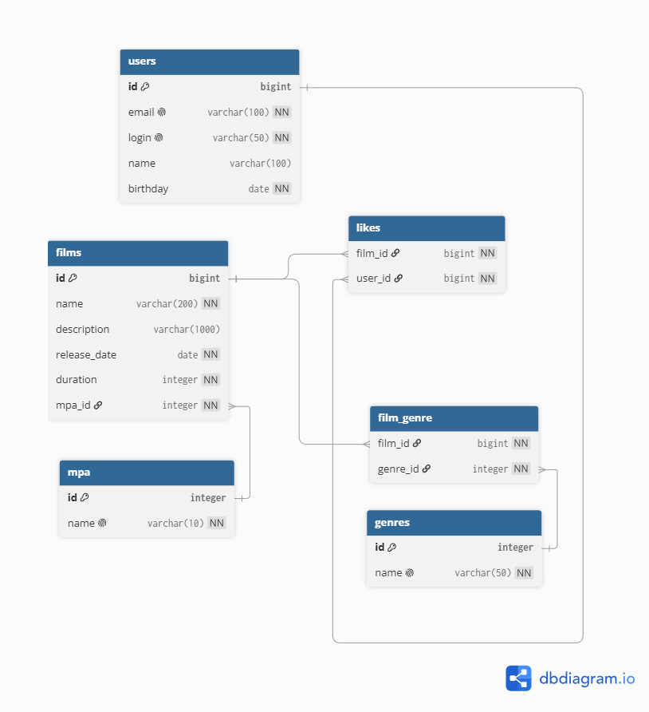

# java-filmorate
Template repository for Filmorate project.

## Схема БД 

Ссылка на файл диаграммы -
https://dbdiagram.io/d/6a3a7c5dd0074fe75d04e45d

#### Получить все фильмы с рейтингом и жанрами

SELECT 
    f.*,
    m.name as mpa_rating,
    GROUP_CONCAT(g.name) as genres
FROM films f
LEFT JOIN mpa m ON f.mpa_id = m.id
LEFT JOIN film_genre fg ON f.id = fg.film_id
LEFT JOIN genres g ON fg.genre_id = g.id
GROUP BY f.id;

#### Получить 10 топ популярных

SELECT
f.id,
f.name,
COUNT(l.user_id) as likes_count
FROM films f
LEFT JOIN likes l ON f.id = l.film_id
GROUP BY f.id
ORDER BY likes_count DESC
LIMIT 10;